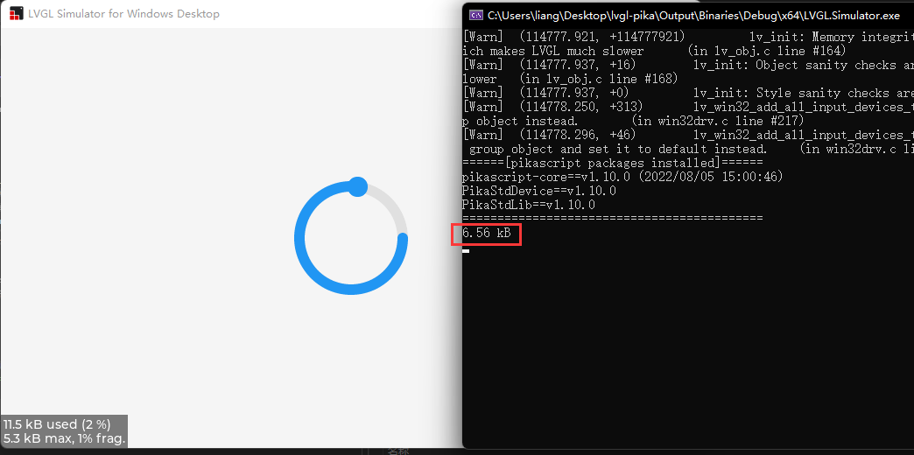
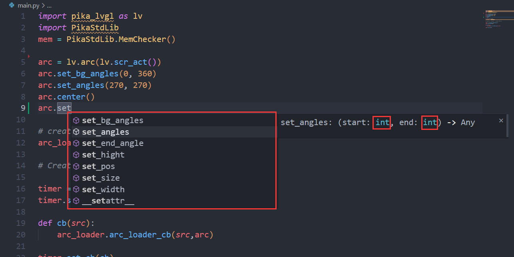
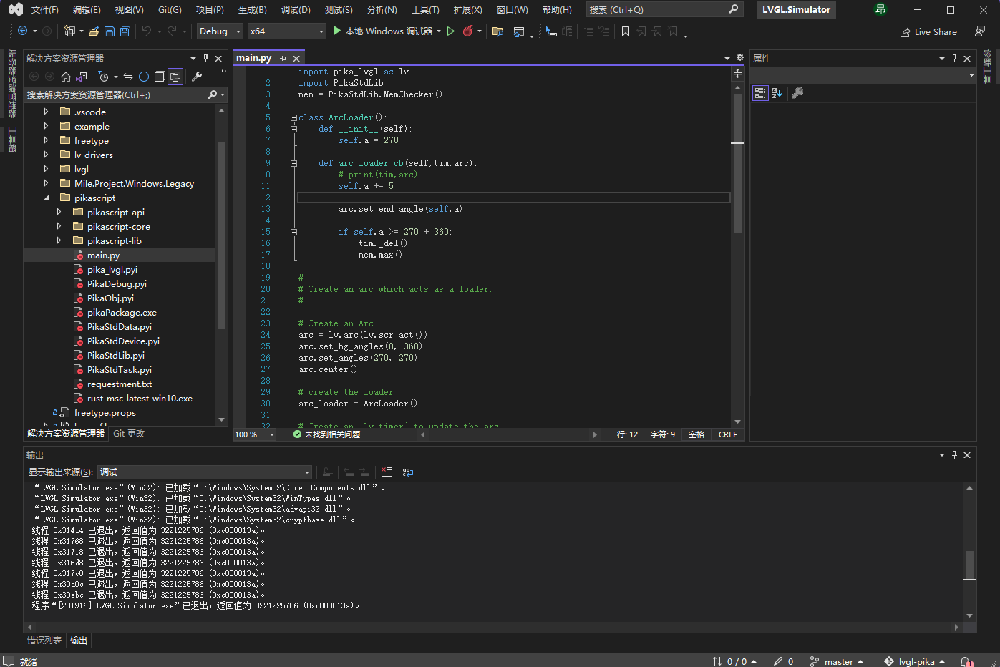
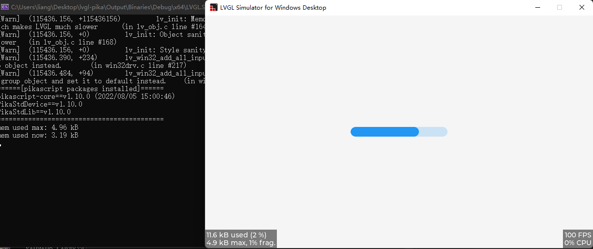
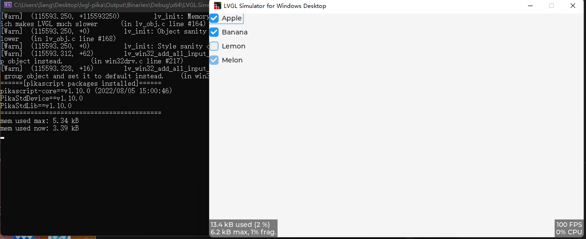

# What is PikaScript ?

PikaScript is a Python interpreter designed specifically for microcontrollers, and it supports a subset of the common Python3 syntax, github: https://github.com/pikasTech/pikascript

It's lighter, requiring only 32k of code space and 4k of RAM, which means it can run on stm32f103c8 (blue-pill) or even stm32g030c8, on the other hand, you can leave valuable space for more material or build larger buffer areas.

It is simpler, out of the box, runs with no porting and configuration at all, does not depend on OS and file system, has good support for popular IDEs for Windows platforms like Keil, IAR, RT-Thread-Studio, and of course, supports linux-gcc development platforms.

It's smarter, with a unique C module mechanism that allows you to generate bindings automatically by simply writing the API for the C module in Python, and you don't need to deal with the headache of writing any macros or global tables manually. On the other hand, all C modules have sophisticated smart hints, even hinting at the types of your arguments .

---

# Why PikaScript + LVGL ?

PikaScript now supports the main features of LVGL8, and these APIs are fully compatible with Micropython!

This means that you can continue to use already written code from Micropython, and then use less code space and RAM.

The peak memory footprint of the ring animation DEMO is just 6.56kB



Enjoy detailed code hints down to the parameter type for a better programming experience



Use a more convenient IDE, such as vs-based simulation projects



# So how does it look like?

Here are some examples of lvgl that PikaScript can already run, they are mainly from the lvgl documentation examples

## LV_ARC

```python
import pika_lvgl as lv
import PikaStdLib
mem = PikaStdLib.MemChecker()

# Create an Arc
arc = lv.arc(lv.scr_act())
arc.set_end_angle(200)
arc.set_size(150, 150)
arc.center()

print('mem used max: %0.2f kB' % (mem.getMax()))
print('mem used now: %0.2f kB' % (mem.getNow()))

```


## LV_BAR

``` python
import pika_lvgl as lv
import PikaStdLib
mem = PikaStdLib.MemChecker()

bar1 = lv.bar(lv.scr_act())
bar1.set_size(200, 20)
bar1.center()
bar1.set_value(70, lv.ANIM.OFF)

print('mem used max: %0.2f kB' % (mem.getMax()))
print('mem used now: %0.2f kB' % (mem.getNow()))
```



## LV_BTN

``` python
import pika_lvgl as lv
import PikaStdLib
mem = PikaStdLib.MemChecker()


def event_cb_1(evt):
    print('in evt1')
    print('mem used now: %0.2f kB' % (mem.getNow()))


def event_cb_2(evt):
    print('in evt2')
    print('mem used now: %0.2f kB' % (mem.getNow()))


btn1 = lv.btn(lv.scr_act())
btn1.align(lv.ALIGN.TOP_MID, 0, 10)
btn2 = lv.btn(lv.scr_act())
btn2.align(lv.ALIGN.TOP_MID, 0, 50)
btn1.add_event_cb(event_cb_1, lv.EVENT.CLICKED, 0)
btn2.add_event_cb(event_cb_2, lv.EVENT.CLICKED, 0)

print('mem used max: %0.2f kB' % (mem.getMax()))
print('mem used now: %0.2f kB' % (mem.getNow()))
```


## LV_CHECKBOX

``` python
import pika_lvgl as lv
import PikaStdLib
mem = PikaStdLib.MemChecker()

cb = lv.checkbox(lv.scr_act())
cb.set_text("Apple")
cb.align(lv.ALIGN.TOP_LEFT, 0 ,0)

cb = lv.checkbox(lv.scr_act())
cb.set_text("Banana")
cb.add_state(lv.STATE.CHECKED)
cb.align(lv.ALIGN.TOP_LEFT, 0 ,30)

cb = lv.checkbox(lv.scr_act())
cb.set_text("Lemon")
cb.add_state(lv.STATE.DISABLED)
cb.align(lv.ALIGN.TOP_LEFT, 0 ,60)

cb = lv.checkbox(lv.scr_act())
cb.add_state(lv.STATE.CHECKED | lv.STATE.DISABLED)
cb.set_text("Melon")
cb.align(lv.ALIGN.TOP_LEFT, 0 ,90)

print('mem used max: %0.2f kB' % (mem.getMax()))
print('mem used now: %0.2f kB' % (mem.getNow()))
```



## LV_DRAG

``` python
import pika_lvgl as lv
from PikaStdLib import MemChecker

mem = MemChecker()

def drag_event_handler(e):

    obj = e.get_target()

    indev = lv.indev_get_act()

    vect = lv.point_t()
    indev.get_vect(vect)
    x = obj.get_x() + vect.x
    y = obj.get_y() + vect.y
    obj.set_pos(x, y)
    mem.now()


#
# Make an object dragable.
#

obj = lv.obj(lv.scr_act())
obj.set_size(150, 100)
obj.add_event_cb(drag_event_handler, lv.EVENT.PRESSING, None)

label = lv.label(obj)
label.set_text("Drag me")
label.center()

```


## LV_LABEL

``` python
import pika_lvgl as lv
import PikaStdLib
mem = PikaStdLib.MemChecker()

label1 = lv.label(lv.scr_act())
LV_LABEL_LONG_WRAP = 0
label1.set_long_mode(LV_LABEL_LONG_WRAP)      # Break the long lines*/
# Enable re-coloring by commands in the text
label1.set_recolor(True)
label1.set_text("#0000ff Re-color# #ff00ff words# #ff0000 of a# label, \
align the lines to the center and  wrap long text automatically.")
# Set smaller width to make the lines wrap
label1.set_width(150)
label1.set_style_text_align(lv.ALIGN.CENTER, 0)
label1.align(lv.ALIGN.CENTER, 0, -40)

LV_LABEL_LONG_SCROLL_CIRCULAR = 3
label2 = lv.label(lv.scr_act())
label2.set_long_mode(LV_LABEL_LONG_SCROLL_CIRCULAR)  # Circular scroll
label2.set_width(150)
label2.set_text("It is a circularly scrolling text. ")
label2.align(lv.ALIGN.CENTER, 0, 40)

print('mem used max: %0.2f kB' % (mem.getMax()))
print('mem used now: %0.2f kB' % (mem.getNow()))

```


---

# How does it work?

PikaScript has a unique C module smart binding tool

Just write the Python interface in pika_lvgl.pyi (.pyi is the python interface file)

``` python
# pika_lvgl.pyi
class arc(lv_obj):
    def set_end_angle(self, angle: int): ...
    def set_bg_angles(self, start: int, end: int): ...
    def set_angles(self, start: int, end: int): ...
```

Then PikaScript's pre-compiler can automatically bind the following C functions, simply by naming the functions in the module_class_method format, without any additional work, and all binding and registration is done automatically.

``` C
/* pika_lvgl_arc.c */
void pika_lvgl_arc_set_end_angle(PikaObj* self, int angle) {
    lv_obj_t* lv_obj = obj_getPtr(self, "lv_obj");
    lv_arc_set_end_angle(lv_obj, angle);
}

void pika_lvgl_arc_set_bg_angles(PikaObj *self, int start, int end){
    lv_obj_t* lv_obj = obj_getPtr(self, "lv_obj");
    lv_arc_set_bg_angles(lv_obj, start, end);
}

void pika_lvgl_arc_set_angles(PikaObj *self, int start, int end){
    lv_obj_t* lv_obj = obj_getPtr(self, "lv_obj");
    lv_arc_set_angles(lv_obj, start, end);
}
```

To use the module, just `import pika_lvgl` and the precompiler will automatically scan main.py and bind the `pika_lvgl` module

```
$ ./rust-msc-latest-win10.exe 
(pikascript) packages installed:
    pikascript-core==v1.10.0
    PikaStdLib==v1.10.0
    PikaStdDevice==v1.10.0

(pikascript) pika compiler:
  scaning main.py...
    binding pika_lvgl.pyi...
```

The precompiler is written in Rust, runs on windows and linux, and is completely open source.

In addition to binding C modules, the precompiler compiles Python scripts to bytecode in the PC, reducing the size of the script and increasing its speed.

---

# How can I use it?

The simulation repo on vs is available on https://github.com/pikasTech/lv_pikascript

---

